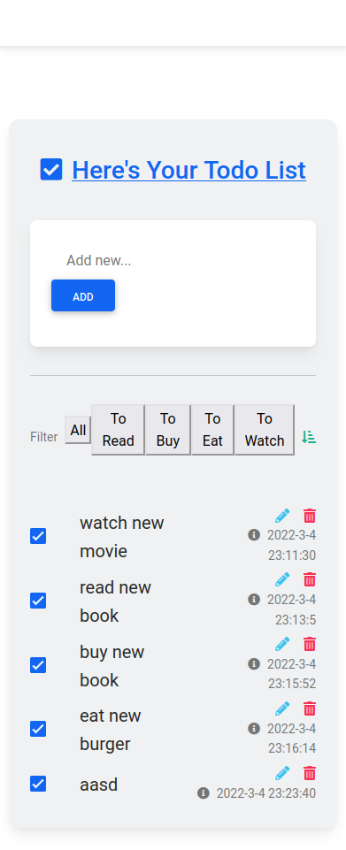

<div id="top"></div>

[![Contributors][contributors-shield]][contributors-url]
[![Forks][forks-shield]][forks-url]
[![Stargazers][stars-shield]][stars-url]
[![Issues][issues-shield]][issues-url]
[![MIT License][license-shield]][license-url]
[![LinkedIn][linkedin-shield]][linkedin-url]

<!-- PROJECT LOGO -->
<br />
<div align="center">

  <p align="center">
    A truly intelligent, machine-learning to-do list organizer.
    <br />
    <br />
    <a href="https://github.com/AlulaLeak/todo-ai/issues">Report Bug</a>
     · 
    <a href="https://github.com/AlulaLeak/todo-ai/issues">Request Feature</a>
  </p>
</div>
    <br />

<!-- TABLE OF CONTENTS -->
<details>
  <summary>Table of Contents</summary>
  <ol>
    <li>
      <a href="#about-the-project">About The Project</a>
      <ul>
        <li><a href="#built-with">Built With</a></li>
      </ul>
    </li>
    <li>
      <a href="#getting-started">Getting Started</a>
      <ul>
        <li><a href="#installation">Installation</a></li>
      </ul>
    </li>
    <li><a href="#usage">Usage</a></li>
    <li><a href="#roadmap">Roadmap</a></li>
    <li><a href="#contributing">Contributing</a></li>
    <li><a href="#license">License</a></li>
    <li><a href="#contact">Contact</a></li>
    <li><a href="#acknowledgments">Acknowledgments</a></li>
  </ol>
</details>

<!-- ABOUT THE PROJECT -->

## About The Project

<div align="center">
    <br />
  <a href="./images/todo-ai.png">
    
  </a>
  </div>
    <br />

As the user submits a new to-do list reminder into the app, the NLP library classifies the reminder into 4 catagories. This app comes pre-trained but also gets smarter with more usage. The user can add as many to-do list reminders as they would like.

<p align="right">(<a href="#top">back to top</a>)</p>

### Built With

Major frameworks/libraries used:

- [Natural.js](https://www.npmjs.com/package/natural)
- [jQuery](https://jquery.com/)
- [Express](https://expressjs.com/)
- [PostgreSQL](https://www.postgresql.org/)

<p align="right">(<a href="#top">back to top</a>)</p>

<!-- GETTING STARTED -->

## Getting Started

### Installation

_Installing and setting up your app. - This app relies on a database. Here we are using PostgreSQL._

1. Clone the repo
   ```sh
   git clone https://github.com/AlulaLeak/todo-ai
   ```
2. Install NPM packages in both client and server folders
   ```sh
   npm install
   ```
3. Enter authentication details into client/.env
   ```
    DB_HOST=<Database-Host>
    DB_USER=<Username-Associated-To-Database>
    DB_PASS=<Password-Of-Your-Database>
    DB_NAME=<Name-Of-Your-Database>
    DB_PORT=<Port-Connecting-To-Database>(5432-By-Default)
   ```
4. Add seeds from db/seeds to your PostgreSQL database.

5. Start your app with
   ```
   npm run local
   ```
6. Reset the database
   ```
   npm run db:reset
   ```
7. Visit
   ```
   http://localhost:8080/
   ```

<p align="right">(<a href="#top">back to top</a>)</p>

<!-- CONTRIBUTING -->

## Contributing

Contributions are what make the open source community such an amazing place to learn, inspire, and create. Any contributions you make are **greatly appreciated**.

If you have a suggestion that would make this better, please fork the repo and create a pull request. You can also simply open an issue with the tag "enhancement".
Don't forget to give the project a star! Thanks again!

1. Fork the Project
2. Create your Feature Branch (`git checkout -b feature/AmazingFeature`)
3. Commit your Changes (`git commit -m 'Add some AmazingFeature'`)
4. Push to the Branch (`git push origin feature/AmazingFeature`)
5. Open a Pull Request

<p align="right">(<a href="#top">back to top</a>)</p>

<!-- LICENSE -->

## License

Distributed under the MIT License. See `LICENSE.txt` for more information.

<p align="right">(<a href="#top">back to top</a>)</p>

<!-- CONTACT -->

## Contact

Alula Leakemariam - [LinkedIn](https://www.linkedin.com/in/alula-leakemariam-903059233/) - alula.leakemariam94@gmail.com

Project Link: [https://github.com/AlulaLeak/todo-ai]

<p align="right">(<a href="#top">back to top</a>)</p>

<!-- ACKNOWLEDGMENTS -->

## Acknowledgments

- [Img Shields](https://shields.io)
- [GitHub Pages](https://pages.github.com)
- [Font Awesome](https://fontawesome.com)

<p align="right">(<a href="#top">back to top</a>)</p>

<!-- MARKDOWN LINKS & IMAGES -->
<!-- https://www.markdownguide.org/basic-syntax/#reference-style-links -->

[contributors-shield]: https://img.shields.io/github/contributors/AlulaLeak/todo-ai.svg?style=for-the-badge
[contributors-url]: https://github.com/AlulaLeak/todo-ai/graphs/contributors
[forks-shield]: https://img.shields.io/github/forks/AlulaLeak/todo-ai.svg?style=for-the-badge
[forks-url]: https://github.com/AlulaLeak/todo-ai/network/members
[stars-shield]: https://img.shields.io/github/stars/AlulaLeak/todo-ai.svg?style=for-the-badge
[stars-url]: https://github.com/AlulaLeak/todo-ai/stargazers
[issues-shield]: https://img.shields.io/github/issues/AlulaLeak/todo-ai.svg?style=for-the-badge
[issues-url]: https://github.com/AlulaLeak/todo-ai/issues
[license-shield]: https://img.shields.io/github/license/AlulaLeak/todo-ai.svg?style=for-the-badge
[license-url]: https://github.com/AlulaLeak/todo-ai/tree/master/LICENSE.txt
[linkedin-shield]: https://img.shields.io/badge/-LinkedIn-black.svg?style=for-the-badge&logo=linkedin&colorB=555
[linkedin-url]: https://www.linkedin.com/in/alula-leakemariam-903059233/
[product-screenshot]: images/screenshot.png
